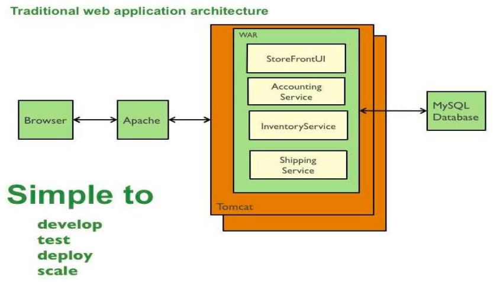
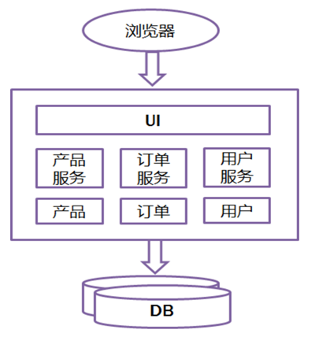
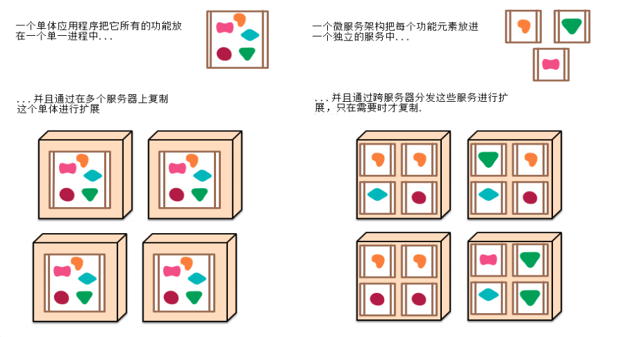
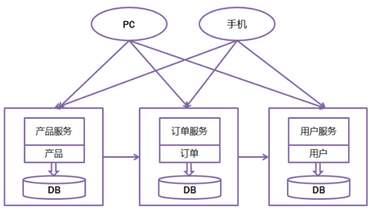

# SpringBoot简介

#### Java的开发一直让开发人员诟病

1. Java项目开发复杂度极高
2. Java项目的维护非常困难
3. 在云时代如何实现项目的快速部署以及快速启动
4. 即便使用了大量的开发框架，发现我们的开发也没少多少
   当所有人认为Spring不再前进的时候，Spring推出了位架构实现的两个框架：SpringBoot,SpringCloud

#### Java开发的复杂度是最高的？

**在所有的软件行业中，如果要说商用体系，排在第一位的永远是Java,因为Java的体系丰富，支持度高，**
**安全性也高，但是同时开发者也需要忍受以下的痛苦：**	

* Java里面的开发都支持属于原生操作代码，例如：JDBC中，如果使用Java的原生代码，会重复编写大量的代码，如PreparedStatement操作

* Java进行WEB开发项目时候，必须要按照严格的格式进行WEB项目的创建，以及每当创建WEB项目时候，又需要进行Tomcat的重新启动

* Java中虽然提供了所谓的开发标准，但是所有的公司几乎都有自己的标准.例如：Java起初的JVM有三个版本，而且很多公司由于 版本不同会造成部署环境不同

* Java里面严格要求按照MVC的设计模式完成

* web开发为例，一个良好的JSP程序代码中不应该有任何的scriptlet代码，
  要实现非常麻烦。有各种实现标准，例如：JSTL+EL ，springTaglib,JSF....

* Java后期的发展使用了大量的Maven技术作为开发，但是使用之后还是没有逃离传统WEB开发的身影，
  所有的项目依然需要打包，然后上传到系统中。使用Maven还有一个最大的痛：如果是开发框架，那一堆
  的Maven的依赖库很庞大繁杂。

* Rest技术已经开始在行业中流传，Java要想实现Rest开发（基于Spring）,很麻烦

* 现在行业中，Spring已经作为绝对的Java架构，但是要想在Spring中整合其他框架，需要编程一堆堆的*.xml文件

  `所以在这样大的历史背景下，很多人开始寻找更简单的开发，而遗憾的是没有被JDK或JavaEE锁支持，因为这只是平台，平台能够提供的只是最原始的技术支持。这时候SpringBoot改变了所有开发的困境，或者说最终奉承的宗旨：废除所有的复杂开发，废除所有的配置，让开发更简洁纯粹，核心"零配置"（DREAM）` 

### 单体应用

> 一个归档包（可以是JAR、WAR、EAR或其它归档格式）包含所有功能的应用程序，通常称为单体应用。
>  而架构单体应用的方法论，就是单体应用架构。

 

#### 优点:

- 便于共享：单个归档文件包含所有功能，便于在团队之间以及不同的部署阶段之间共享。
- 易于测试：单体应用一旦部署，所有的服务或特性就都可以使用了，这简化了测试过程，因为没有额外的依赖，每项测试都可以在部署完成后立刻开始。
- 易于部署：只需将单个归档文件复制到单个目录下。

#### 缺点:

* 效率低：开发都在同一个项目改代码，相互等待，冲突不断

* 护难：代码功功能耦合在一起，新人不知道何从下手

* 不灵活：构建时间长，任何小修改都要重构整个项目，耗时

* 稳定性差：一个微小的问题，都可能导致整个应用挂掉

* 扩展性不够：无法满足高并发下的业务需求

#### 微服务架构

微服务架构（Microservice Architecture）是一种架构概念，旨在通过将功能分解到各个离散的服务中以实现对解决方案的解耦。你可以将其看作是在架构层次而非获取服务的

类上应用很多SOLID原则。微服务架构是个很有趣的概念，它的主要作用是将功能分解到离散的各个服务当中，从而降低系统的耦合性，并提供更加灵活的服务支持。

**概念：**把一个大型的单个应用程序和服务拆分为数个甚至数十个的支持微服务，它可扩展单个组件而不是整个的应用程序堆栈，从而满足服务等级协议。

**定义：**围绕业务领域组件来创建应用，这些应用可独立地进行开发、管理和迭代。在分散的组件中使用云架构和平台式部署、管理和服务功能，使产品交付变得更加简单。

**本质：**用一些功能比较明确、业务比较精练的服务去解决更大、更实际的问题。

 

 

#### 总结

**SpringBoot适合做微服务开发**

