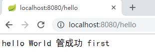
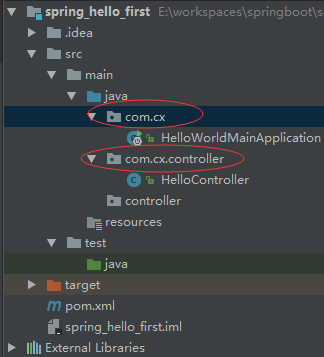

# SpringBoot简介

- 简化Spring应用开发的一个框架
- 整个Spring技术栈的一个大整合
- J2EE开发的 一站式解决方案
- 内置Servlet容器
- 约定大于配置
- starter：启动器
- 与云计算的天然集成

## SpringBoot快速搭建

[官网示例](https://docs.spring.io/spring-boot/docs/2.1.1.RELEASE/reference/htmlsingle/#_learning_about_spring_boot_features)

本节介绍如何开发一个简单的“Hello World！”Web应用程序，该应用程序突出了Spring Boot的一些主要功能。我们使用Maven来构建这个项目，因为大多数IDE都支持它。

#### 系统要求

Spring Boot 2.1.1.RELEASE requires **[Java 8](https://www.java.com/)** and is compatible up to Java 11 (included). [Spring Framework 5.1.3.RELEASE](https://docs.spring.io/spring/docs/5.1.3.RELEASE/spring-framework-reference/) or above is also required.

Explicit build support is provided for the following build tools:

| 构建工具 | 版本 |
| -------- | ---- |
| Maven    | 3.3+ |
| Gradle   | 4.4+ |

##### Servlet容器

Spring Boot supports the following embedded servlet containers:

| Name         | Servlet Version |
| ------------ | --------------- |
| Tomcat 9.0   | 4.0             |
| Jetty 9.4    | 3.1             |
| Undertow 2.0 | 4.0             |

You can also deploy Spring Boot applications to any Servlet 3.1+ compatible container.

### SpringBoot HelloWorld

完成功能:浏览器发起hello请求,服务器接收请求并处理,响应Hello World字符串

1. **创建maven的普通工程(jar)**

2. **创建POM**

   ~~~xml
   <?xml version="1.0" encoding="UTF-8"?>
   <project xmlns="http://maven.apache.org/POM/4.0.0"
            xmlns:xsi="http://www.w3.org/2001/XMLSchema-instance"
            xsi:schemaLocation="http://maven.apache.org/POM/4.0.0 			   	http://maven.apache.org/xsd/maven-4.0.0.xsd">
       <modelVersion>4.0.0</modelVersion>
   
       <groupId>com.cx</groupId>
       <artifactId>spring_hello_first</artifactId>
       <version>1.0-SNAPSHOT</version>
   
       <properties>
           <project.build.sourceEncoding>UTF-8</project.build.sourceEncoding>
           <maven.compiler.source>1.8</maven.compiler.source>
           <maven.compiler.target>1.8</maven.compiler.target>
       </properties>
   
       <!--继承默认值为Spring Boot-->
       <parent>
           <groupId>org.springframework.boot</groupId>
           <artifactId>spring-boot-starter-parent</artifactId>
           <version>2.1.1.RELEASE</version>
       </parent>
   
       <!--添加Web应用程序的典型依赖项-->
       <dependencies>
           <dependency>
               <groupId>org.springframework.boot</groupId>
               <artifactId>spring-boot-starter-web</artifactId>
           </dependency>
       </dependencies>
       <build>
           <finalName>spring_hello_first</finalName>
           <plugins>
               <!--
             我们通过创建一个完全自包含的可执行jar文件来完成我们的示例，我们可以在生产中运行它。
             可执行jar（有时称为“fat jar"）是包含已编译类以及代码需要运行的所有jar依赖项的归档。
               -->
               <plugin>
                   <groupId>org.springframework.boot</groupId>
                   <artifactId>spring-boot-maven-plugin</artifactId>
               </plugin>
               <plugin>
                   <groupId>org.apache.maven.plugins</groupId>
                   <artifactId>maven-compiler-plugin</artifactId>
                   <version>3.1</version>
                   <configuration>
                       <source>1.8</source>
                       <target>1.8</target>
                       <encoding>UTF-8</encoding>
                   </configuration>
               </plugin>
           </plugins>
       </build>
   </project>
   ~~~

3. **编写一个主程序,启动Spring Boot应用**

~~~java
/**
 * Spring Boot Maven插件包含一个run可用于快速编译和运行应用程序的目标。应用程序以分解形式运行，
 * 就像在IDE中一样。以下示例显示了运行Spring Boot应用程序的典型Maven命令：
 *
 * mvn spring-boot：run
 *
 * @SpringBootAppication来标注一个主程序类,说明这是一个Spring Boot应用
 */
@SpringBootApplication
public class HelloWorldMainApplication{
    public static void main(String[] args) {
        //Spring应用启动
        SpringApplication.run(HelloWorldMainApplication.class,args);
    }
}
~~~

4. 编写相关的controller和service

   ~~~java
   @Controller
   public class HelloController {
       @ResponseBody
       @RequestMapping("/hello")
       public String hello(){
           return "hello World 管成功 first";
       }
   }
   
   ~~~

5.  运行方式

   * 直接使用mvn spring-boot:run来启动spring-boot应用

     **此种方式无需编写主程序来启动spring Boot应用**

   * 先运行主程序,启动spring-boot应用.

* 浏览器中执行结果如下:

   

 

## 注意点

**启动类目录应该高于controller目录**

 